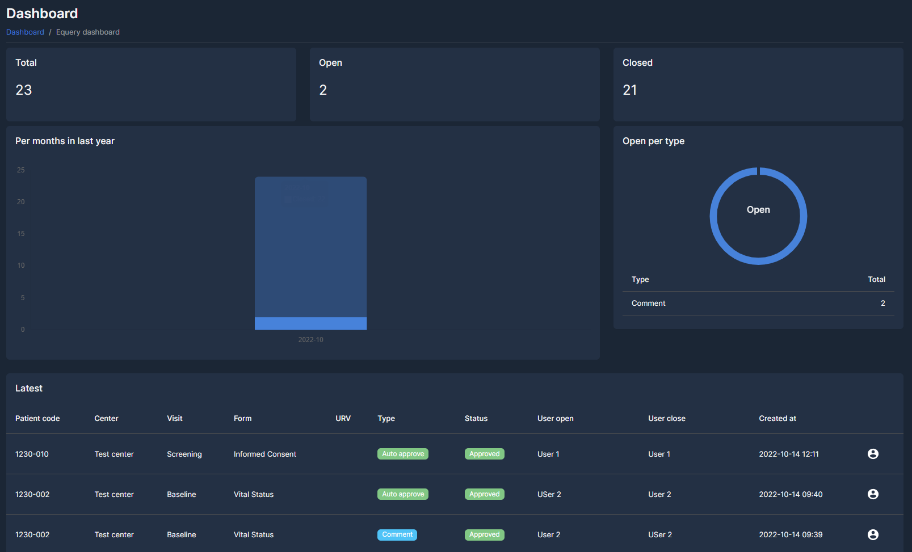

    

# Parte 1

## Introduzione

Gentile candidato, grazie per voler entrare a far parte del mondo di Advice Pharma Group SRL. A tal proposito vorremmo che completasse questo test, della durata di circa 1,5 ore.

## Esecuzione dell'esercizio

Prima di iniziare, rinominare il file .env.example in .env

`mv .env.example .env`

Per ricevere un risultato immediato, eseguire `php artisan test` o `vendor/bin/phpunit`. Inizlamente molti test falliranno: il suo compito è, appunto, evitare che falliscano.

<strong>NON</strong> si devono modificare i file di test. E' possibile creare, modificare, cancellare files all'interno delle directory app/ e database/ a seconda dell'esigenza.

E' consentita la creazione di nuove migration e/o modifica di una esistente.

## Criteri di accettabilità

Tutti i test devono risultare in stato `pass`. Eventuali esiti `fail` potranno essere contemplati se si fornisce una spiegazione (Commento) della logica che si vuole implementare.

Non ci sono soluzioni giuste o sbagliate a prescindere.

## Criteri di valutazione

- [x] Corretta esecuzione del codice
- [x] Pulizia del codice
- [x] Utilizzo di costrutti/metodi/classi Laravel
- [x] Presenza di commenti (se necessario)
- [x] Ottimizzazione del codice
- [ ] Utilizzo di package esterni

# Parte 2

## Analisi feature
 
 
  
Scrivere un documento in formato word o pdf che contenga l'analisi applicativa per poter prdurre una dashboard come quella in esempio, indicando i tempi ed i metodi di sviluppo stimati. 

Si deve tenere presente che il database ed i model sono già presenti all'interno dell'applicazione. Non sono presenti gli endpoint per il recupero dei dati, le query/logiche di lettura dati dal database, e tutta l'interfaccia grafica.

# Come inviare l'esercizio

Creare un fork di questo progetto, effettuare le modifiche ed inviare il link al fork a <a href="mailto:developer.advice@advicepharma.com">developer.advice@advicepharma.com</a>.

Per qualsiasi informazione scrivere a <a href="mailto:developer.advice@advicepharma.com">developer.advice@advicepharma.com</a>.
